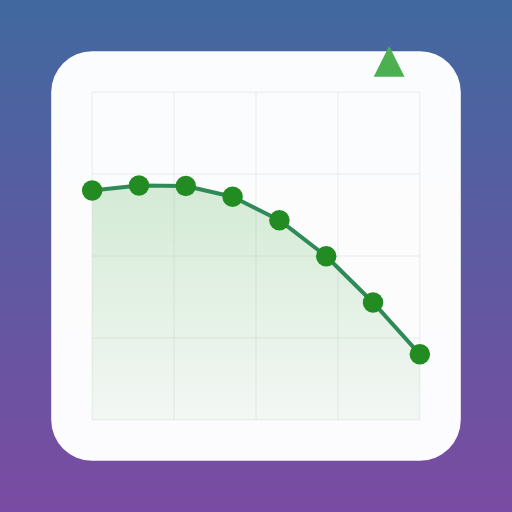

# iPhone PWA 最適化ガイド

このドキュメントでは、Stock Scanner の iPhone PWA 最適化機能について説明します。

## 📱 実装された機能

### 1. フルスクリーン表示

#### メニフェスト設定 (`manifest.json`)
```json
{
  "display": "standalone",
  "orientation": "portrait",
  "background_color": "#ffffff",
  "theme_color": "#667eea"
}
```

**効果:**
- ブラウザの UI（アドレスバー、タブバーなど）を非表示
- ネイティブアプリのような没入感のある体験
- ステータスバーのカスタマイズ

#### HTML メタタグ (`_app.tsx`)
```html
<meta name="viewport" content="width=device-width, initial-scale=1, viewport-fit=cover, user-scalable=no">
<meta name="apple-mobile-web-app-capable" content="yes">
<meta name="apple-mobile-web-app-status-bar-style" content="black-translucent">
```

**機能:**
- `viewport-fit=cover`: ノッチエリアを活用
- `apple-mobile-web-app-capable`: ホーム画面追加に対応
- `black-translucent`: ステータスバーの背景を透過

### 2. スプラッシュスクリーン

#### ファイル構成
```
public/splash/
├── splash-1125x2436.png    # iPhone 12 Pro Max
├── splash-1242x2208.png    # iPhone 8 Plus
├── splash-1170x2532.png    # iPhone 14 Pro Max
└── splash-1284x2778.png    # iPhone 15 Pro Max
```

#### 実装方法

**Apple メタタグ:**
```html
<link rel="apple-touch-startup-image" 
  href="/splash/splash-1125x2436.png" 
  media="(device-width: 375px) and (device-height: 812px) and (-webkit-device-pixel-ratio: 3)">
```

**JavaScript スプラッシュスクリーン:**
```tsx
const [showSplash, setShowSplash] = useState(true);

useEffect(() => {
  const timer = setTimeout(() => setShowSplash(false), 1000);
  return () => clearTimeout(timer);
}, []);
```

**表示内容:**
- アプリロゴ（📈 絵文字）
- アプリタイトル「Stock Scanner」
- ローディングプログレスバー

### 3. タッチ操作最適化

#### ボタンサイズ
Apple HIG（Human Interface Guidelines）に準拠：
```css
button, a, input {
  min-height: 44px;  /* 推奨: 44×44px 以上 */
  min-width: 44px;
}
```

#### タッチハイライト削除
```css
-webkit-tap-highlight-color: transparent;
```

ユーザー操作時の不要なハイライトを削除し、スムーズな体験を実現。

#### セーフエリア対応
```css
.safe-top {
  padding-top: max(12px, env(safe-area-inset-top));
}

.safe-bottom {
  padding-bottom: max(12px, env(safe-area-inset-bottom));
}
```

**対応デバイス:**
- iPhone 12 以降（Dynamic Island）
- iPhone X 以降（ノッチ）
- iPhone XR、SE など

#### スクロール最適化
```css
.scroll-container {
  -webkit-overflow-scrolling: touch;  /* バウンススクロール */
  overflow-y: auto;
}
```

#### レスポンシブ設計
```tailwind
<!-- モバイル優先 -->
<h1 class="text-3xl md:text-4xl">Stock Scanner</h1>

<!-- タッチターゲット -->
<button class="min-h-[48px] md:py-4">予測実行</button>

<!-- 隠すカラム -->
<td class="hidden md:table-cell">推奨</td>
```

## 🎨 UI/UX 改善

### ビジュアル最適化

#### グラデーション背景
```css
background: linear-gradient(135deg, #667eea 0%, #764ba2 100%);
```

#### モーション効果
```tailwind
<!-- タップ時のスケーリング -->
<button class="active:scale-95 transition-all">

<!-- ローディングアニメーション -->
<div class="animate-spin">

<!-- フェードイン -->
<div class="animate-fadeIn">
```

### インタラクション設計

#### タッチフィードバック
- `active:scale-95`: タップ時の視覚フィードバック
- `touch-manipulation`: ブラウザのズーム遅延を削除
- `cursor-pointer`: ホバー時のカーソル表示

#### テキスト選択制御
```html
<!-- 選択不可（ボタンやラベルなど） -->
<h1 class="no-select">Stock Scanner</h1>

<!-- 選択可（本文など） -->
<p class="selectable">データ説明</p>
```

## 📲 インストール方法

### iOS 17+ でのインストール

#### 方法 1: Share シート から
1. Safari でアプリを開く
2. Share ボタン（下向き矢印）をタップ
3. 「ホーム画面に追加」をタップ
4. 名前を確認して「追加」

#### 方法 2: メニューから
1. Safari のメニュー（3 本線）をタップ
2. 「ホーム画面に追加」をタップ

### iOS 16 以前

1. Safari のアドレスバーの共有ボタンをタップ
2. 下にスクロールして「ホーム画面に追加」
3. 確認して追加

## ⚙️ 技術仕様

### メタタグ一覧

| メタタグ | 値 | 説明 |
|---------|-----|------|
| `apple-mobile-web-app-capable` | `yes` | PWA 有効化 |
| `apple-mobile-web-app-status-bar-style` | `black-translucent` | ステータスバー（透過黒） |
| `apple-mobile-web-app-title` | `Stock Scanner` | ホーム画面表示名 |
| `viewport-fit` | `cover` | ノッチエリアの利用 |
| `theme-color` | `#667eea` | ブラウザカラー |

### スプラッシュスクリーン仕様

**推奨サイズ:**
- 1125×2436px (iPhone 12 Pro Max)
- 1170×2532px (iPhone 14 Pro)
- 1284×2778px (iPhone 15 Pro Max)

**フォーマット:** PNG（推奨）

**背景:** グラデーション（#667eea → #764ba2）

### ノッチ対応サイズ

| デバイス | 幅 × 高さ | safe-area-inset-bottom |
|--------|----------|----------------------|
| iPhone 12 Pro | 390×844 | 34px |
| iPhone 14 | 390×844 | 34px |
| iPhone 15 Pro | 393×852 | 34px |

## 🔍 デバッグ

### Safari Developer Tools

1. Mac で Safari を開く
2. 設定 → 詳細 → 開発メニューを表示
3. アプリ実行中に Develop メニューから iPhone を選択
4. Web Inspector で DOM を確認

### コンソールログ

```javascript
// Service Worker 登録状態確認
navigator.serviceWorker.getRegistrations().then(regs => {
  console.log('SW Registrations:', regs);
});

// PWA インストール状態確認
if (navigator.onLine) {
  console.log('Online');
} else {
  console.log('Offline');
}
```

## 📊 パフォーマンス最適化

### キャッシュ戦略

**キャッシュ優先（静的アセット）:**
```javascript
// style.css, icon-192.png など
cacheFirst(request);
```

**ネットワーク優先（API）:**
```javascript
// /api/predict, /api/backtest など
networkFirst(request);
```

### 遅延ローディング

```html
<!-- 画像の遅延読み込み -->


<!-- コンポーネントの code splitting -->
const StockList = dynamic(() => import('@/components/StockList'));
```

## 🐛 トラブルシューティング

### スプラッシュスクリーンが表示されない

**原因:** メディアクエリが一致していない

**解決:**
```html
<!-- デバイス仕様に合わせる -->
<link rel="apple-touch-startup-image" 
  href="/splash/splash-1170x2532.png" 
  media="(device-width: 390px) and (device-height: 844px)">
```

### ノッチが切られている

**原因:** `viewport-fit=cover` が設定されていない

**解決:**
```html
<meta name="viewport" content="viewport-fit=cover">
```

### タッチ遅延がある

**原因:** タップハイライトの処理

**解決:**
```css
* {
  -webkit-tap-highlight-color: transparent;
  touch-action: manipulation;
}
```

## 📚 参考資料

- [Apple - Configuring Web Applications](https://developer.apple.com/library/archive/documentation/AppleApplications/Reference/SafariWebContent/ConfiguringWebApplications/ConfiguringWebApplications.html)
- [Web.dev - Install prompt](https://web.dev/customize-install/)
- [MDN - Safe Area Insets](https://developer.mozilla.org/en-US/docs/Web/CSS/env())

---

**最終更新:** 2026年4月20日
**バージョン:** 1.0
